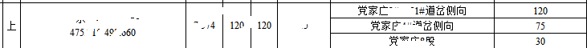

# Unmerge Cell in Excel
=========

- python 3.5
- openpyxl 2.4??
- win10

项目需要把excel中的数据导入到oracle中。

蛋疼的是Excel中的数据很多像是这样。



导入oracle中会有很多错误。

手动一个一个将大的单元格中的数据拆分成单个，需要消耗大量时间。

无奈。

有困难找Python！！

查到openpyxl可以操纵数据库，从文档开始学起！！！！

```Python
#!/usr/bin/python
# -*- coding: UTF-8 -*-

# **********************************************************
# * Author        : jiao
# * Email         : jybhaha@gmail.com
# * Create time   : 2016-10-19 16:02
# * Last modified : 2016-10-19 16:02
# * Filename      : xlswriter.py
# * Description   : 
# **********************************************************

from openpyxl.reader.excel import load_workbook
from openpyxl.worksheet.protection import SheetProtection


filename='test.xlsx'
sheetRowMaxLength=1101
listColumn=['A','B','C','D','E','F','G']

workbook = load_workbook(filename=filename)
sheetnames=workbook.get_sheet_names()
worksheet = workbook.get_sheet_by_name(sheetnames[0])

tempRow=1
for i in listColumn:
	for j in range(1,sheetRowMaxLength):
		if(worksheet[i+str(j)].value == None):
			if(j != sheetRowMaxLength-1):
				tempRow=tempRow+1
			else:
				worksheet.unmerge_cells(i+str(j-tempRow)+':'+i+str(j))
				for k in range(0,tempRow):
					worksheet[i+str(j-k)].value=worksheet[i+str(j-tempRow)].value
		else:
			if(tempRow!=1):
				print('\n********\n'+'unmerging:  '+i+str(j-tempRow)+'  to   '+i+str(j-1))
				try:
					worksheet.unmerge_cells(i+str(j-tempRow)+':'+i+str(j-1))
				except BaseException:
					tempRow=1
					continue
				for k in range(0,tempRow-1):
					worksheet[i+str(j-k-1)].value=worksheet[i+str(j-tempRow)].value
				tempRow=1
			else:
				continue
print('ending')
workbook.save('test2.xlsx')


```

